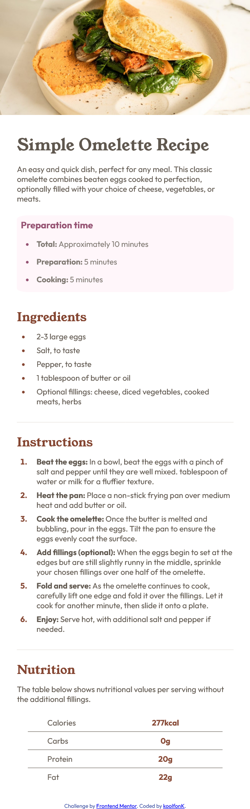

# Frontend Mentor - Recipe page solution

This is a solution to the [Recipe page challenge on Frontend Mentor](https://www.frontendmentor.io/challenges/recipe-page-KiTsR8QQKm). Frontend Mentor challenges help you improve your coding skills by building realistic projects. 

## Table of contents

- [Overview](#overview)
  - [Screenshot](#screenshot)
- [My process](#my-process)
  - [Built with](#built-with)
  - [What I learned](#what-i-learned)
  - [Continued development](#continued-development)
  - [Useful resources](#useful-resources)
- [Author](#author)

## Overview

This was my first frontendmentor challenge. I liked working on it and would apreciate feedback.

### Screenshot/Live page


[github] (https://koolfonk.github.io/recipe-repo/)

## My process

After I accepted the challenge, I began writing the HTML and CSS. 
I feel like it is all a bit messy because I didn't have a plan from 
the start but worked on things when they needed to be changed. When 
I didn't know how to do something I looked online for an awnser.
I worked mobile first.

### Built with

- Semantic HTML5 markup
- CSS custom properties
- Mobile-first workflow


### What I learned

I practiced more basic HTML an CSS. 
I also praciced how to style the bullet points in a list

```css
li::marker {
  color: hsl(14, 45%, 36%);
  font-weight: bold;
}
```


### Continued development

I want to practice more with basic HTML and CSS while also trying some more advanced things.

### Useful resources

- [W3schools](https://www.w3schools.com) - This site helped me when I forgot someting I learned before.

## Author

- Frontend Mentor - [@koolfonk](https://www.frontendmentor.io/profile/koolfonK)
